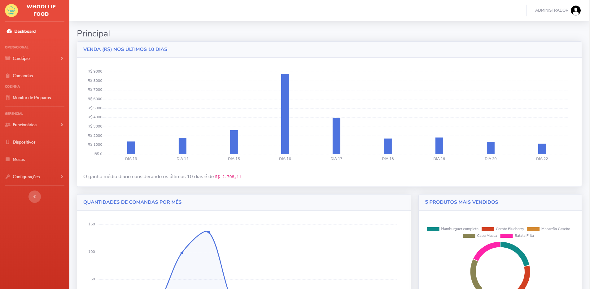
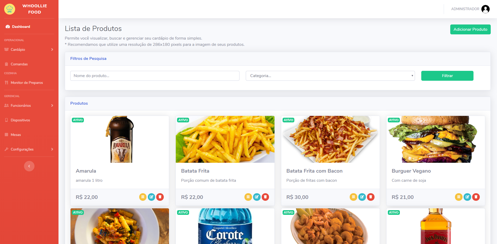

# Nota

O projeto Whoollie Food é um Trabalho Acadêmico apresentado à disciplina do Curso de Sistemas de Informação, do 5º semestre, 3º período, Fundação Hermínio Ometto – UNIARARAS, como parte integrante da avaliação docente

# Resumo

Whoollie Food é um Software para gerenciamento e administração de bares, restaurantes e lanchonetes de usabilidade ágil, proporcionando ao responsável do estabelecimento o controle sobre: o acesso de funcionários, edição do cardápio e monitoramento dos pedidos. Já o cliente tem uma plataforma mobile de autoatendimento intuitiva e interativa que também diminui o tempo de espera para o cliente ser atendimento.

Tecnologias utilizadas: PHP 7, SLIM Framework, Bootstrap, jQuery, HTML5, CSS3, MySQL

# Autores:
- Douglas Numeriano
- Eduardo Geraldini
- Elder Samuel
- Jhonatan Lopes
- Marlon Englemam
